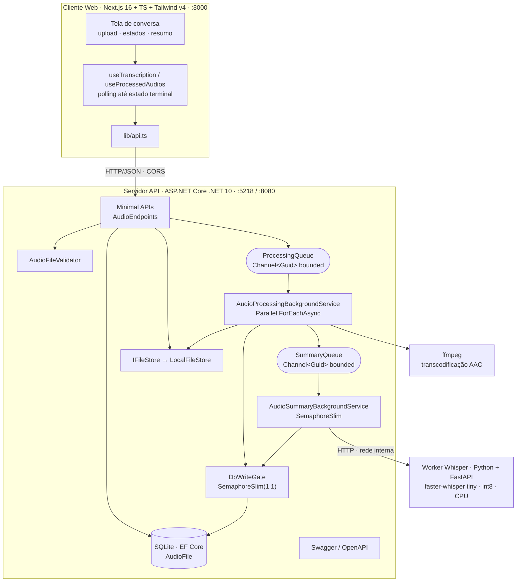
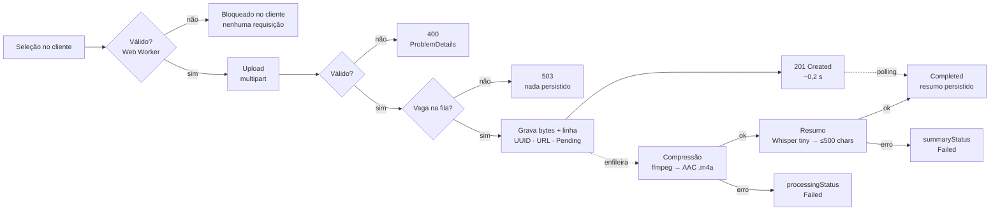
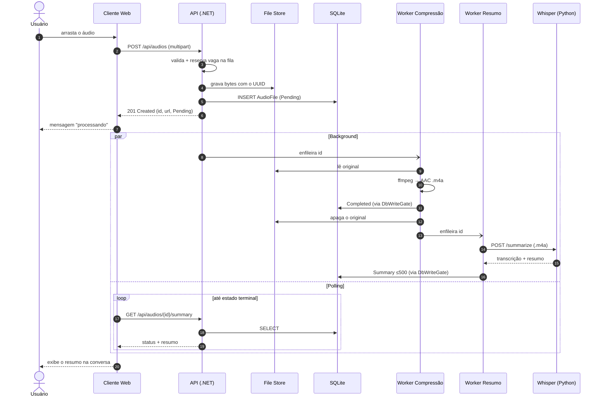
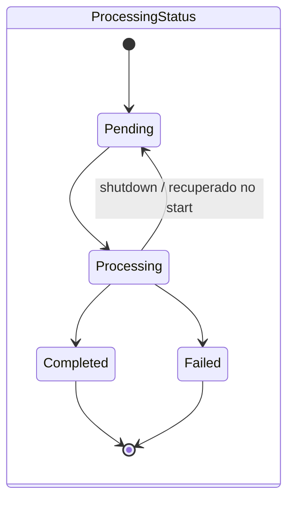
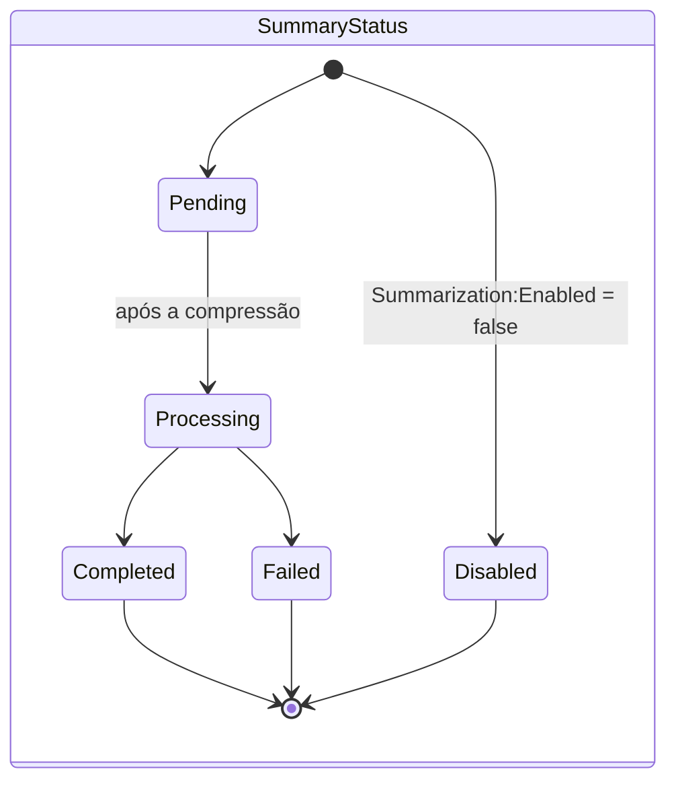
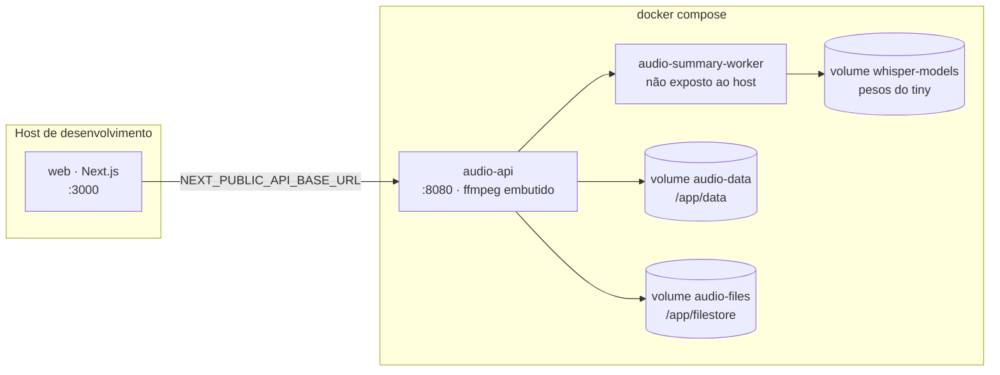

# Documento de Arquitetura — Audio Upload API

> Entregável da atividade de meio de período. Escopo, objetivos, caso de uso, componentes,
> diagramas do pipeline e decisões. O passo a passo de execução está no
> [`README.md`](../README.md) na raiz.

---

## 1. Escopo do problema

Aplicações que lidam com áudio enviado por usuários (mensagens de voz, gravações de reunião,
ditados) enfrentam três problemas ao mesmo tempo:

1. **O arquivo é grande.** Um WAV de 5 minutos passa fácil de 40 MB. Guardar o formato bruto
   multiplica custo de disco e de banda em toda leitura posterior.
2. **O conteúdo é opaco.** Áudio não é pesquisável nem escaneável: para saber o que há dentro,
   alguém precisa ouvir do começo ao fim.
3. **O processamento é caro e lento.** Transcodificar e transcrever custa segundos a minutos por
   arquivo — muito mais do que qualquer requisição HTTP deveria durar.

O erro comum é resolver os três dentro do `POST`: o cliente fica pendurado esperando `ffmpeg` e o
modelo de transcrição, o timeout estoura, e um pico de uploads simultâneos derruba o servidor.

**Este projeto resolve os três, mas fora do caminho da requisição.**

### Fora do escopo (decisões explícitas)

| Fora | Por quê |
| --- | --- |
| Autenticação / multi-tenancy | O exercício foca no pipeline de mídia; não há modelo de usuário. |
| Armazenamento em nuvem (S3/Blob) | A abstração `IFileStore` já isola isso; a implementação local basta para o escopo. |
| Transcrição paga (OpenAI, AssemblyAI…) | O requisito é rodar com modelo local e leve — Whisper `tiny`, offline. |
| Retry automático de jobs | Áudio inválido é falha permanente; não existe critério seguro de idempotência aqui. |
| Migrations de banco | Schema criado com `EnsureCreated()`; o domínio é estável e o escopo é acadêmico. |

---

## 2. Objetivos

**Funcionais**

| # | Objetivo | Como é verificado |
| --- | --- | --- |
| F1 | Receber áudio via `multipart/form-data` e rejeitar o que não é áudio | `AudioFileValidator` + `AudioFileValidatorTests` |
| F2 | Gerar um **UUID** por arquivo, gravar os bytes no file store e registrar UUID + URL + metadados no banco | `AudioApiIntegrationTests` |
| F3 | **Comprimir** para AAC (`.m4a`) sem bloquear a requisição | `AudioProcessingIntegrationTests`, `FfmpegAudioCompressorTests` |
| F4 | **Resumir** o áudio em ≤ 500 caracteres com IA local | `SummaryTruncatorTests`, `AudioSummaryIntegrationTests` |
| F5 | Expor consulta de metadados, resumo, download e listagem | `AudioApiIntegrationTests` |
| F6 | Cliente web que envia o áudio e mostra o resultado na mesma tela | Vitest em `web/__tests__` |
| F7 | Bloquear no cliente, **antes do upload**, arquivo que não é áudio aceitável | `audio-validation`, `upload-validation-flow` (Vitest) |

**Não funcionais**

| # | Objetivo | Meta / resultado |
| --- | --- | --- |
| N1 | O `POST` responde antes de qualquer trabalho pesado | ~0,2 s para um WAV de 42 MB (era ~2,9 s → ≈ 14x) |
| N2 | Degradar sob carga sem cair | Fila cheia → **503** limpo, sem persistir upload órfão |
| N3 | Aproveitar todos os núcleos na compressão | `Parallel.ForEachAsync`, `MaxDegreeOfParallelism = ProcessorCount` |
| N4 | Nunca corromper o banco com escritas concorrentes | `DbWriteGate` (`SemaphoreSlim(1,1)`) — SQLite aceita um escritor |
| N5 | Não perder trabalho no shutdown | Jobs interrompidos voltam a `Pending` e são recuperados no start |
| N6 | API documentada e testável sem cliente | Swagger/OpenAPI + `AudioApi.http` |

---

## 3. Caso de uso

**Ator:** pessoa com uma gravação em mãos que quer saber o que há nela sem ouvir tudo.

**Fluxo principal — "enviar um áudio e receber o resumo"**

1. O usuário arrasta o arquivo para o cliente web (`http://localhost:3000`).
2. O front envia `POST /api/audios` com o arquivo em `multipart/form-data`.
3. A API valida, reserva vaga na fila, grava os bytes, cria a linha e responde **201** com o UUID,
   a URL de download e `processingStatus: "Pending"`.
4. A tela mostra imediatamente o áudio como uma mensagem "processando" na conversa.
5. Em background: o worker de compressão transcodifica para `.m4a`, apaga o original e enfileira o
   resumo; o worker de resumo chama o Whisper local e grava o texto (≤ 500 caracteres).
6. O front faz polling em `GET /api/audios/{id}/summary` até o estado ser terminal, e então
   substitui a mensagem pelo resumo.

**Fluxos alternativos**

| Situação | Resposta do sistema |
| --- | --- |
| Arquivo não é áudio (nome/content-type/tamanho) | **400** com `ProblemDetails` — validação é barata, fica dentro da requisição |
| Filas saturadas | **503** *antes* de gravar arquivo ou linha — nada de lixo no disco |
| Arquivo passa na validação mas o `ffmpeg` não decodifica | Continua **201**; a falha aparece depois como `processingStatus: "Failed"` + `processingError` |
| Worker de resumo indisponível / desligado | Áudio segue armazenado e comprimido; `summaryStatus: "Failed"` ou `"Disabled"`, e a mensagem na tela diz o motivo |
| Processo cai no meio de um job | Job volta a `Pending` e é reenfileirado no próximo start |

---

## 4. Arquitetura — componentes

### Responsabilidade de cada componente

| Componente | Responsabilidade | Por que existe separado |
| --- | --- | --- |
| **Cliente Web** (`web/`) | Upload, estados de carregamento, histórico das 10 conversas mais recentes, polling | Consome só HTTP; pode ser trocado sem tocar no servidor |
| **Minimal APIs** (`Endpoints/AudioEndpoints.cs`) | Único ponto de entrada HTTP; valida, admite e responde | Concentra o contrato; nenhuma regra de processamento vive aqui |
| **`AudioFileValidator`** | Nome, content-type e tamanho | Validação barata — cabe dentro da requisição |
| **`IFileStore` / `LocalFileStore`** | Bytes em disco + URL resolvível de download | Contrato desenhado para um `S3FileStore` futuro entrar sem mexer nos endpoints |
| **EF Core + SQLite** | Registro `AudioFile`: UUID, URL, metadados, estados | Um banco por arquivo do repositório, zero setup |
| **`ProcessingQueue` / `SummaryQueue`** | `Channel<Guid>` **bounded** com reserva de vaga | O bound é o mecanismo de backpressure: sem vaga → 503 |
| **Worker de compressão** | Consome a fila com `Parallel.ForEachAsync`, chama `ffmpeg`, troca o original pelo `.m4a`, enfileira o resumo | CPU-bound, escala com os núcleos da máquina |
| **Worker de resumo** | Chama o Whisper e grava ≤ 500 caracteres | I/O-bound contra uma VPS de 4 vCPUs → concorrência 1 por padrão |
| **`DbWriteGate`** | Serializa escritas de background | SQLite aceita um escritor por vez |
| **Worker Whisper** (`worker/`) | Transcreve e resume, local e offline | Isola o runtime Python/modelo do processo .NET |
| **Swagger + `.http`** | Contrato executável da API | Testar e demonstrar sem depender do front |

---

## 5. Pipeline do sistema

### 5.1 Visão do pipeline (o que acontece com um arquivo)

O ponto central: a linha sólida é a requisição HTTP e termina em ~0,2 s; as linhas tracejadas são
trabalho em background. Nada de `ffmpeg` ou Whisper dentro do `POST`. À esquerda do upload, a
validação em Web Worker do cliente evita a requisição inteira quando o arquivo já é reprovável —
sem substituir a validação do servidor, que continua respondendo `400`.

### 5.2 Sequência completa

### 5.3 Máquinas de estado

### 5.4 Modelo de concorrência

| Etapa | Primitiva | Grau | Motivo |
| --- | --- | --- | --- |
| Admissão | `Channel<Guid>` bounded + reserva | `QueueCapacity: 100` | Backpressure explícito: sem vaga → 503 antes de escrever |
| Compressão | `Parallel.ForEachAsync` | `ProcessorCount` | CPU-bound, escala com os núcleos |
| Resumo | `SemaphoreSlim` | 1 (padrão) | I/O contra uma VPS de 4 vCPUs; mais paralelismo só atrasa todo mundo |
| Escrita no banco | `SemaphoreSlim(1,1)` (`DbWriteGate`) | 1 | SQLite aceita um escritor por vez |
| Validação pré-upload (cliente) | **Web Worker** dedicado, com fallback assíncrono | 1 por seleção | Tira a leitura e a checagem de assinatura da thread que pinta a interface |

### 5.5 Política de exceções do worker

| Classe real | Política |
| --- | --- |
| `OperationCanceledException` com token do host cancelado | Não é falha do áudio: volta a `Pending`, propaga o cancelamento, recupera no próximo start |
| `AudioCompressionException` (ffmpeg ≠ 0) | Falha permanente do item: marca só aquele áudio como `Failed` e continua |
| `FileNotFoundException` do arquivo específico | Falha conhecida do item: mensagem pública sem caminho, segue para os próximos jobs |
| Demais `IOException` / `UnauthorizedAccessException`, `Win32Exception`, `DbUpdateException` / `SqliteException`, não classificados | Potencialmente sistêmico: log `Critical`, exceção fatal sanitizada, terminalização best-effort |

Não há retry automático — áudio inválido é falha permanente, e o projeto não tem critério seguro de
idempotência para filesystem ou SQLite.

---

## 6. Contrato da API

| Método | Rota | Sucesso | Erros |
| --- | --- | --- | --- |
| `POST` | `/api/audios` | **201** + `Location` + `AudioFileDto` | **400** inválido · **503** fila cheia |
| `GET` | `/api/audios` | **200** lista (mais recentes primeiro) | — |
| `GET` | `/api/audios/{id}` | **200** `AudioFileDto` | **404** |
| `GET` | `/api/audios/{id}/download` | **200** stream (original enquanto `Pending`/`Processing`, `.m4a` depois) | **404** |
| `GET` | `/api/audios/{id}/summary` | **200** `AudioSummaryDto` | **404** |
| `GET` | `/health` | **200** | — |

Erros usam **`ProblemDetails`** (RFC 7807). O contrato vive em dois lugares executáveis:

- **Swagger UI** — `http://localhost:5218/swagger` (JSON cru em `/swagger/v1/swagger.json`).
- **`src/AudioApi/AudioApi.http`** — 12 requisições prontas, incluindo os casos de erro,
  encadeadas pelo id da resposta do upload.

---

## 7. Deploy

Dois modos suportados:

- **`dotnet run`** — API em `:5218`, sumarização **desligada** por padrão (`dotnet test` e o CI
  nunca dependem de rede nem de worker de pé).
- **`docker compose up --build`** — API em `:8080` **com** a sumarização ligada; o worker baixa o
  modelo sozinho na primeira execução e a API espera o `/health` dele antes de aceitar tráfego.

Estado persistido em três volumes nomeados; nada de estado dentro do container.

---

## 8. Decisões de arquitetura

| Decisão | Alternativa rejeitada | Motivo |
| --- | --- | --- |
| Processar em background, não no `POST` | Comprimir e transcrever na requisição | Transcrição escala com a **duração** do áudio (~10x tempo real): um upload de 50 MB levaria minutos |
| Duas filas separadas | Uma fila só para as duas etapas | Perfis opostos: compressão é CPU-bound e paralela, resumo é I/O-bound e serial |
| `Channel` bounded com reserva prévia | `DropWrite` | O runtime retorna `true` mesmo descartando o novo item — mentira silenciosa |
| Reservar vaga **antes** de gravar | Gravar e depois enfileirar | Sem reserva, um 503 deixaria arquivo e linha órfãos no disco |
| `IFileStore` como abstração | `File.WriteAllBytes` direto nos endpoints | Permite trocar por S3/Blob sem tocar nos endpoints |
| SQLite | Postgres | Escopo acadêmico; um arquivo, zero setup. O `DbWriteGate` é o preço pago |
| Whisper `tiny` local | API paga de transcrição | Requisito de IA leve local; roda offline após o primeiro download |
| Limite de 500 caracteres em 3 camadas | Só no worker | Worker + `SummaryTruncator.Clamp` na API + `HasMaxLength(500)` na coluna — nenhuma camada confia na anterior |
| Sem retry | Retry com backoff | Áudio inválido é falha permanente; não há critério seguro de transitoriedade aqui |

---

## 9. Qualidade

- **43 testes** (xUnit) no servidor, todos verdes, nenhum precisando de rede ou do worker:
  validação, integração ponta a ponta com `WebApplicationFactory`, pipeline de processamento,
  compressor, truncamento do resumo e sumarizador com stub.
- **Vitest + React Testing Library** no cliente: estados de tela, histórico, primitivas de UI,
  tokens de design e camada de API.
- **Gate de sandbox** em Docker — sem rede, non-root (`docker-compose.dark-factory.yml`).
- **Medições** registradas em [`week4-threading-pipeline.md`](week4-threading-pipeline.md) e
  [`week5-parallel-users-before-after.md`](week5-parallel-users-before-after.md) (CSV bruto em
  `benchmarks/`).

## 10. Documentos relacionados

| Documento | Conteúdo |
| --- | --- |
| [`../README.md`](../README.md) | Configuração, execução, endpoints, configuração completa |
| [`DESIGN.md`](DESIGN.md) | Especificação visual do cliente web e tokens |
| [`week2-analysis.md`](week2-analysis.md) | Por que ainda **não** era hora de paralelizar |
| [`week3-threading-explanation.md`](week3-threading-explanation.md) | O resumo sai da requisição |
| [`week4-threading-pipeline.md`](week4-threading-pipeline.md) | A compressão também sai, e a medição |
| [`week5-parallel-users-before-after.md`](week5-parallel-users-before-after.md) | Usuários simultâneos antes e depois |
| [`week6-frontend-parallel-validation.md`](week6-frontend-parallel-validation.md) | Paralelismo no cliente: validação em Web Worker antes do upload |
| [`presentation.html`](presentation.html) | Slides de apresentação |
