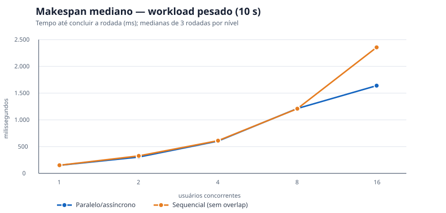
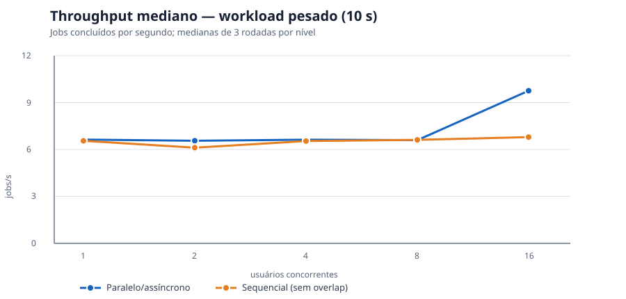

# Atividade #1 — benchmark sequencial versus paralelo/assíncrono

## Resultado

A API agora oferece dois modos no mesmo binário:

- <code>Processing:ExecutionMode=Parallel</code> (padrão): <code>Parallel.ForEachAsync</code>, limitado por <code>Processing:MaxConcurrency</code>.
- <code>Processing:ExecutionMode=Sequential</code>: consome a fila em um único <code>await foreach</code> e termina cada áudio antes de ler o próximo. “Sequencial” aqui significa **zero overlap entre jobs**; os <code>await</code>s de filesystem, SQLite e ffmpeg continuam assíncronos porque são I/O/processos obrigatórios da API.

O cliente também tem os dois caminhos:

- <code>NEXT_PUBLIC_AUDIO_VALIDATION_MODE=parallel</code> (padrão): Web Worker real.
- <code>NEXT_PUBLIC_AUDIO_VALIDATION_MODE=sequential</code>: validação ordenada na thread principal, sem Worker; o núcleo síncrono está em <code>validateAudioBytes</code>.

No workload curto (WAV de 1 s, 16.078 bytes), 8 usuários produziram makespan mediano de 1.145,018 ms paralelo e 1.145,565 ms sequencial: economia de apenas **0,05%**. No workload pesado (WAV de 10 s, 160.078 bytes), 16 usuários produziram 1.639,768 ms paralelo e 2.355,617 ms sequencial: economia de **30,40%** e aumento de throughput de 6,792 para 9,757 jobs/s (**+43,65%**).

Isso não significa que o paralelo sempre seja mais rápido: com 8 usuários pesados a diferença foi **−0,29%**, pois os processos ffmpeg e as escritas SQLite disputaram os mesmos recursos. Não houve saturação da fila, 503, falha ou timeout; portanto estes dados não determinam capacidade máxima.

## Requisitos e evidências

| Requisito | Evidência |
| --- | --- |
| Versão sequencial da API | <code>AudioExecutionMode.cs</code>, <code>ProcessingOptions.ExecutionMode</code> e <code>ConsumeSequentiallyAsync</code>. O worker de resumo aceita o mesmo modo. |
| Versão sequencial do cliente | <code>validateAudioBytes</code>, <code>validateAudioFileSequential</code> e o terceiro argumento de <code>validateAudioFileInBackground</code>. |
| Comparação otimizada versus sequencial | <code>scripts/activity-1-sequential-benchmark.sh</code>, executado com o mesmo binário e alternância de ordem. |
| Benchmarks reais | CSV leve e CSV pesado em <code>docs/benchmarks/</code>; 24 amostras no CSV leve e 30 no pesado, todas com <code>criterion_pass=true</code>. |
| Métricas importantes | p50/p95/máxima do POST, makespan até <code>Completed</code>, jobs/s, status HTTP, estados finais, hash/tamanho/duração da fixture. |
| Economia de tempo | Fórmula: <code>(sequencial − paralelo) / sequencial × 100</code>, calculada sobre a mediana por nível. |
| Gráficos | Gráficos Mermaid abaixo e SVGs estáticos incorporados em [`api-heavy-makespan.svg`](benchmarks/api-heavy-makespan.svg) e [`api-heavy-throughput.svg`](benchmarks/api-heavy-throughput.svg). |
| Conclusões e análise | Seções de análise, limitações e decisão. |

## Protocolo da API

Cada amostra publica a API em Release, inicia processo, banco SQLite e file store novos, executa um upload de aquecimento fora da medição e dispara N POSTs simultâneos. Cada id é consultado até <code>ProcessingStatus=Completed</code>. O critério de aprovação exige:

1. todos os POSTs em HTTP 201;
2. zero HTTP 503 ou outros status;
3. todos os ids em <code>Completed</code>, sem <code>Failed</code>, <code>Pending</code>, <code>Processing</code> ou ausentes;
4. p95 do POST abaixo do SLA configurado.

Parâmetros comuns: <code>MaxConcurrency=4</code>, sumarização desligada e três rounds por nível. O CSV leve usa 1/2/4/8 usuários; o pesado usa 1/2/4/8/16. A ordem dos modos é alternada por round. A fixture leve tem SHA-256 <code>95108475b505ace0068ae38cd5c20aa5df372f362a7ea1346ab78ed32cb774d1</code>. A pesada tem SHA-256 <code>2a845a5e50b727e0c040b8939135fd2af9311399a2c8b2803513ea384d7564dd</code>. Ambiente: .NET SDK 10.0.111, ffmpeg 6.1.1, Linux 7.0.0-30-generic x86_64.

### Workload curto

Medianas das três rodadas; tempos em ms.

| Usuários | POST p50 paralelo | POST p50 seq. | POST p95 paralelo | POST p95 seq. | Makespan paralelo | Makespan seq. | Economia | Jobs/s paralelo | Jobs/s seq. |
| ---: | ---: | ---: | ---: | ---: | ---: | ---: | ---: | ---: | ---: |
| 1 | 10,696 | 10,580 | 10,696 | 10,580 | 86,790 | 88,631 | 2,08% | 11,522 | 11,283 |
| 2 | 9,875 | 10,013 | 160,786 | 161,595 | 241,092 | 241,146 | 0,02% | 8,296 | 8,294 |
| 4 | 161,172 | 162,098 | 461,952 | 461,259 | 541,237 | 541,607 | 0,07% | 7,390 | 7,385 |
| 8 | 461,693 | 462,263 | 1.063,300 | 1.063,123 | 1.145,018 | 1.145,565 | **0,05%** | 6,987 | 6,983 |

Fonte bruta: [api-sequential-vs-parallel.csv](benchmarks/api-sequential-vs-parallel.csv).

### Workload pesado

Medianas das três rodadas; tempos em ms.

| Usuários | POST p50 paralelo | POST p50 seq. | POST p95 paralelo | POST p95 seq. | Makespan paralelo | Makespan seq. | Economia | Jobs/s paralelo | Jobs/s seq. |
| ---: | ---: | ---: | ---: | ---: | ---: | ---: | ---: | ---: | ---: |
| 1 | 11,851 | 11,845 | 11,851 | 11,845 | 150,767 | 152,057 | 0,85% | 6,633 | 6,576 |
| 2 | 10,780 | 10,881 | 165,116 | 164,635 | 304,947 | 326,980 | 6,74% | 6,559 | 6,117 |
| 4 | 168,932 | 161,831 | 462,642 | 462,606 | 603,605 | 611,606 | 1,31% | 6,627 | 6,540 |
| 8 | 465,820 | 463,673 | 1.063,741 | 1.064,369 | 1.212,506 | 1.209,000 | **−0,29%** | 6,598 | 6,617 |
| 16 | 315,849 | 315,673 | 1.072,316 | 1.072,313 | **1.639,768** | **2.355,617** | **30,40%** | **9,757** | **6,792** |

Fonte bruta: [api-sequential-vs-parallel-heavy.csv](benchmarks/api-sequential-vs-parallel-heavy.csv).

### Makespan

~~~mermaid
xychart-beta
    title "API — makespan mediano, workload pesado (ms)"
    x-axis ["1", "2", "4", "8", "16 usuários"]
    y-axis "ms" 0 --> 2500
    line "Parallel" [150.767, 304.947, 603.605, 1212.506, 1639.768]
    line "Sequential" [152.057, 326.980, 611.606, 1209.000, 2355.617]
~~~

### Throughput

~~~mermaid
xychart-beta
    title "API — throughput mediano, workload pesado (jobs/s)"
    x-axis ["1", "2", "4", "8", "16 usuários"]
    y-axis "jobs/s" 0 --> 12
    line "Parallel" [6.633, 6.559, 6.627, 6.598, 9.757]
    line "Sequential" [6.576, 6.117, 6.540, 6.617, 6.792]
~~~

## Protocolo do cliente

O teste headless <code>npm run benchmark:client</code> mede o núcleo serial, a leitura assíncrona da API de <code>File</code> e o custo do protocolo Worker 40 vezes em 16 KiB, 256 KiB e 1 MiB. Como jsdom não cria thread de browser, esse Worker é um double protocolar e não é usado como evidência de paralelismo. O benchmark serial não promete ausência literal de <code>async</code>: a leitura de <code>Blob.arrayBuffer()</code> é uma API de I/O assíncrona; a comparação garante que não há Worker nem jobs sobrepostos.

A evidência real está em <code>web/app/benchmark/page.tsx</code>. No Edge headless 151.0.4129.107 foram feitas 12 validações em série por modo sobre uma File de 8 MiB:

| Modo | Total (ms) | Média por seleção (ms) | Timer do event loop (ms) |
| --- | ---: | ---: | ---: |
| Sequencial, thread principal | 3,400 | 0,283 | 0,600 |
| Worker real | 165,300 | 13,775 | 0,400 |

Dados completos: [client-validation.json](benchmarks/client-validation.json).

O Worker custa mais tempo de parede neste workload porque cria thread, copia a mensagem e encerra o worker para cada seleção. O timer do event loop ficou próximo e não autoriza uma porcentagem forte de melhoria de responsividade. A conclusão segura é isolamento de thread; não há economia medida no algoritmo atual.

## Análise

O POST não executa ffmpeg: grava o original, persiste o job e responde 201. Por isso o paralelismo pouco altera p50 do POST. O makespan inclui a compressão em background, as escritas SQLite protegidas pelo <code>DbWriteGate</code>, file store e polling.

No workload pesado de 16 usuários, quatro jobs podem permanecer em voo e reduzem o makespan mediano em 30,40%. O ganho não chega a 4× porque cada ffmpeg consome CPU, o SQLite aceita um escritor por vez e existem custos de processo e I/O. Em 8 usuários, os recursos já ficam disputados; o modo sequencial venceu por 0,29%. A decisão correta é medir <code>MaxConcurrency</code> por host e duração, não assumir que maior concorrência melhora.

A sumarização foi desligada de propósito: Whisper é outro gargalo, com rede/modelo e concorrência próprios. Embora tenha caminho sequencial configurável, misturá-la invalidaria a atribuição do ganho à compressão.

No cliente, a assinatura usa apenas 16 bytes. O tamanho de 8 MiB não implica leitura de 8 MiB e, portanto, não é um benchmark de CPU proporcional ao upload. O Worker só vale em termos de responsividade se a validação futura ficar CPU-bound; hoje ele tem custo fixo maior.

## Limitações

- As coletas são de um host não isolado e fixture sintética.
- O arquivo leve é curto demais para representar produção; o pesado mostra o efeito apenas em 16 usuários.
- O benchmark leve tem **24 amostras** (4 níveis × 3 rodadas × 2 modos) e o pesado tem **30 amostras** (5 níveis × 3 rodadas × 2 modos); resultados em outros hosts podem inverter a diferença.
- Nenhuma rodada saturou fila nem produziu 503; não há claim de capacidade máxima.
- Não foram medidos Whisper, rede externa, múltiplas instâncias, CPU/RAM/I/O detalhados ou arquivos de 50 MB.
- O timer do browser é observação de agendamento, não uma prova causal de ausência de bloqueio.
- O headless Worker double não é thread real; a página Edge é a evidência real do Worker.

## Reprodução

API curta:

~~~bash
scripts/activity-1-sequential-benchmark.sh \
  --output docs/benchmarks/api-sequential-vs-parallel.csv \
  --force --rounds 3 --max-users 8 --fixture-duration-seconds 1 \
  --max-concurrency 4 --queue-capacity 10 --post-sla-ms 4000 \
  --terminal-deadline-seconds 30 --port 51829
~~~

API pesada:

~~~bash
scripts/activity-1-sequential-benchmark.sh \
  --output docs/benchmarks/api-sequential-vs-parallel-heavy.csv \
  --force --rounds 3 --max-users 16 --fixture-duration-seconds 10 \
  --max-concurrency 4 --queue-capacity 20 --post-sla-ms 4000 \
  --terminal-deadline-seconds 60 --port 51831
~~~

Cliente headless:

~~~bash
cd web
npm run benchmark:client
~~~

Cliente em browser real:

~~~bash
cd web
npm run dev -- --hostname 127.0.0.1 --port 3010
~~~

Abra <http://127.0.0.1:3010/benchmark> e clique em “Executar benchmark”. A página usa o bundle Next e o Worker real; ela não altera dados da API.

## Conclusões

1. O modo paralelo permanece padrão: foi 30,40% mais rápido em makespan e 43,65% melhor em throughput na carga pesada de 16 usuários.
2. O modo sequencial existe como baseline funcional, caminho de baixo recurso e ferramenta de regressão.
3. Não há economia universal: no workload curto e em 8 usuários pesados a melhoria é nula/negativa.
4. O próximo experimento deve variar <code>MaxConcurrency</code> e observar CPU, SQLite e I/O antes de aumentar workers.
5. O Worker do cliente não economizou tempo neste validador; sua razão é isolamento da thread da interface.
6. A capacidade máxima ainda precisa de teste específico com usuários crescentes até 503, timeout ou violação do SLA.
